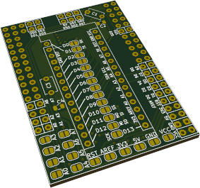
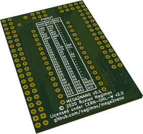
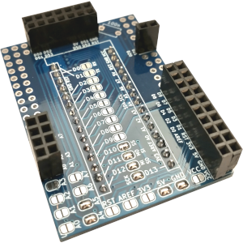
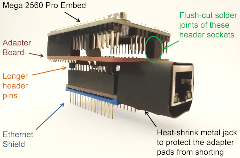

# MEGA2NANO: Mega 2560 PRO Embed to Nano V3 Adapter

This adapter board allows using Mega 2560 PRO Embed boards with shields designed for Nano V3.

This repository includes:

- [schematic](schematic.pdf)
- [gerbers](gerbers.zip)

## Usage

Nano V3 boards are based on ATmega328 microcontroller equipped with only 2KB of SRAM. It is common for complex projects to outgrow this micro and to be replaced with ATmega2560 based boards. Thanks to a wider hardware availability of Nano V3 compatible "shields" (ethernet, sdcard, stepper drivers, etc.), its form-factor is more convinient to use with "plug-and-play" modules. With this adapter, the best of both worlds come together, allowing more powerful ATmega2560 based boards to be conviniently used with widely available hardware modules designed for the Nano V3 form-factor.

## Design

This adapter is designed with the following in mind:

- All power pins (VCC, 5V, 3V3, GND), reset pin (RST) and analog reference pin (AREF) are matched.
- I2C and SPI pins are matched accordingly in order to support I2C and SPI based shields:
    + Nano V3 I2C bus pins (SDA on pin A4 and SCL on pin A5) are matched with Mega 2560 PRO pins (SDA on pin D20 and SCL on pin D21).
    + Nano V3 SPI bus pins (SS on pin 10, MOSI on pin D11, MISO on pin D12 and SCK on pin D13) are matched with Mega 2560 PRO pins (SS on pin D53, MOSI on pin D51, MISO on pin D50 and SCK on pin D52).
- The rest of analog (A0-A7) and digital pins (D0-D9) are matched directly.
- State of every pin (connected/disconnected) can be configured individually using solder jumpers.

Optional THT (5mm) or SMD (0805) bypass capacitors can be placed on 5V (C1 or C2) and 3.3V (C3 or C4) rails.

## Pinout

| NANO | MEGA | BUS  |    | NANO | MEGA | BUS  |    | NANO | MEGA | BUS  |
|------|------|------|----|------|------|------|----|------|------|------|
| GND  | GND  | -    |    | A4   | D20  | SDA  |    | D6   | D6   | -    |
| VCC  | VCC  | -    |    | A5   | D21  | SCL  |    | D7   | D7   | -    |
| 5V   | 5V   | -    |    | A6   | A6   | -    |    | D8   | D8   | -    |
| 3V3  | 3V3  | -    |    | A7   | A7   | -    |    | D9   | D9   | -    |
| RST  | RST  | -    |    | D0   | D0   | RX   |    | D10  | D53  | SS   |
| AREF | AREF | -    |    | D1   | D1   | TX   |    | D11  | D51  | MOSI |
| A0   | A0   | -    |    | D2   | D2   | -    |    | D12  | D50  | MISO |
| A1   | A1   | -    |    | D3   | D3   | -    |    | D13  | D52  | SCK  |
| A2   | A2   | -    |    | D4   | D4   | -    |    |      |      |      |
| A3   | A3   | -    |    | D5   | D5   | -    |    |      |      |      |

## Assembly

- Connect the pads of solder jumpers corresponding to required Nano V3 pins.
- Solder header pins following Nano V3 layout facing away from the layer with solder jumpers.
- Solder header sockets following Mega 2560 PRO Embed layout facing towards the layer with solder jumpers. Header sockets don't have to be connected to the entire footprint of Mega 2560 PRO Embed. Populated pads of the adapter board are marked and annotated. You might choose to leave unused populated pins empty as well.

Depending on layouts of Nano V3 modules, some modifications of the adapter board and/or Nano V3 shields might be required. E.g., a popular ENC28J60 ethernet network shield is equipped with a tall metalized 8P8C jack. Due to the interference of the adapter board with the 8P8C jack, longer header pins are required to maintain a reliable connection with the shield. Solder joints of socket headers at the short side of the adapter board must be trimmed flush with the board and protected from shorting on the metalized 8P8C jack by a layer of insulation (electrical tape, heat shrink, etc.)

## [License](LICENSE)

(C) 2021 Ruslan Nagimov

This source describes Open Hardware and is licensed under the [CERN-OHL-W v2](https:/cern.ch/cern-ohl)

You may redistribute and modify this documentation and make products using it under the terms of the [CERN-OHL-W v2 (https:/cern.ch/cern-ohl)](https:/cern.ch/cern-ohl). This documentation is distributed WITHOUT ANY EXPRESS OR IMPLIED WARRANTY, INCLUDING OF MERCHANTABILITY, SATISFACTORY QUALITY AND FITNESS FOR A PARTICULAR PURPOSE. Please see the [CERN-OHL-W v2](https:/cern.ch/cern-ohl) for applicable conditions.

Source location: https://github.com/nagimov/mega2nano

As per CERN-OHL-W v2 section 4.1, should You produce hardware based on these sources, You must maintain the Source Location visible on the PCB or the external case of the product you make using this documentation.

All text above must be included in any redistribution.
